# Low-Cost-DAQ-System-for-Rocket-Testing

This repository serves as a documentation hub for the development of a **low-cost modular data acquisition system (DAQ)** designed for static fire testing of small rocket motors.

The project encompasses the complete development cycle of embedded hardware, firmware, signal conditioning, ignition control, data acquisition, and experimental validation. It was developed as an affordable alternative to commercial aerospace test systems and experimentally validated during real rocket motor firing campaigns.

The work resulted in peer-reviewed publications, open-access experimental datasets, and a modular hardware platform suitable for research, education, and aerospace development activities.

This repository provides:

* Hardware architecture documentation
* PCB photographs and block diagrams
* Experimental validation results
* Links to scientific publications
* Access to open-access datasets
* References to embedded drivers used throughout the project

---

# 📚 Repository Resources

## Publications

### HardwareX (Elsevier)

**A Versatile Low-Cost Data Acquisition System for Small Rocket Engine Test Bench**

https://www.sciencedirect.com/science/article/pii/S2468067225000641

### III Brazilian Aerospace Congress (CAB)

**DART – A Low-Cost Data Acquisition System for Small Rocket Motor Testing**

https://www.even3.com.br/anais/iii-congresso-aeroespacial-brasileiro/1443161-dart--a-low-cost-data-acquisition-system-for-small-rocket-motor-testing

---

## Open Access Dataset

The complete experimental dataset, supplementary documentation, and validation data are publicly available through Mendeley Data:

https://doi.org/10.17632/c2w7759sd3.2

### License

Creative Commons Attribution Non Commercial 4.0 International (CC BY-NC 4.0)

Users are free to share, adapt, and build upon the material for non-commercial purposes, provided appropriate attribution is given.

---

# 🚀 Project Overview

The system was developed through two hardware generations.

### Generation 1 (2024)

Academic proof-of-concept composed of two stacked PCBs:

* Main DAQ Board
* Pressure Acquisition Board

This version validated the acquisition architecture, sensor conditioning circuits, and communication framework.

### Generation 2 (2025)

Fully redesigned standalone platform composed of:

* Integrated DAQ Board
* Igniter Activation Board
* Power Supply Board

This version integrated pressure acquisition into the main board and added data logging, user interface, ignition control, and safety features for autonomous operation.

---

# ⭐ Key Features

* Compatible with virtually any load cell
* Compatible with standard 4–20 mA industrial pressure transducers
* Integrated thrust and chamber pressure acquisition
* STM32F373 microcontroller with three 16-bit Sigma Delta ADCs
* Programmable PGA308 signal conditioning
* Standalone operation without requiring a PC
* SD card data logging
* Isolated USB and RS-232 communication
* Touchscreen LCD interface
* Safe igniter activation with redundant isolated channels
* Expansion connector for custom sensors and actuators
* Modular architecture for research and educational environments

---

# 📈 Experimental Validation

The developed DAQ was experimentally characterized and compared against the commercial acquisition system previously used by the Vector II Rocketry Project.

Commercial reference system:

* National Instruments USB-6221
* JY-S60 load cell amplifier

### Key Results

* Hardware cost below USD 80
* More than 20× lower cost than the commercial solution
* Noise performance within approximately 10% of the commercial setup when normalized by excitation voltage
* Stable operation during static fire campaigns
* Successful validation under nominal and motor failure conditions
* Measurement quality suitable for aerospace research applications

These results demonstrated that a carefully designed low-cost platform can achieve performance comparable to significantly more expensive commercial alternatives.

---

# 🔄 Updated Version (2025)

## STM32F373-Based Integrated DAQ System

The second-generation system was designed to provide a robust and fully standalone testing platform.

All critical operations, including data acquisition, ignition control, logging, and visualization, can be performed without requiring an external computer.

---

## Main DAQ Board Features

* Integrated pressure acquisition
* SD card logging
* Isolated USB communication (ADUM3166BRSZ)
* 2.4" TFT touchscreen display (ILI9341)
* Protected serial interface
* User button and buzzer
* External status LEDs
* Expansion connector
* Power input protection
* Improved PCB layout and maintainability

---

## 🖼️ Updated Hardware Photos

| Main DAQ Board                                         | Top View                                       | Bottom View                                          |
| ------------------------------------------------------ | ---------------------------------------------- | ---------------------------------------------------- |
| 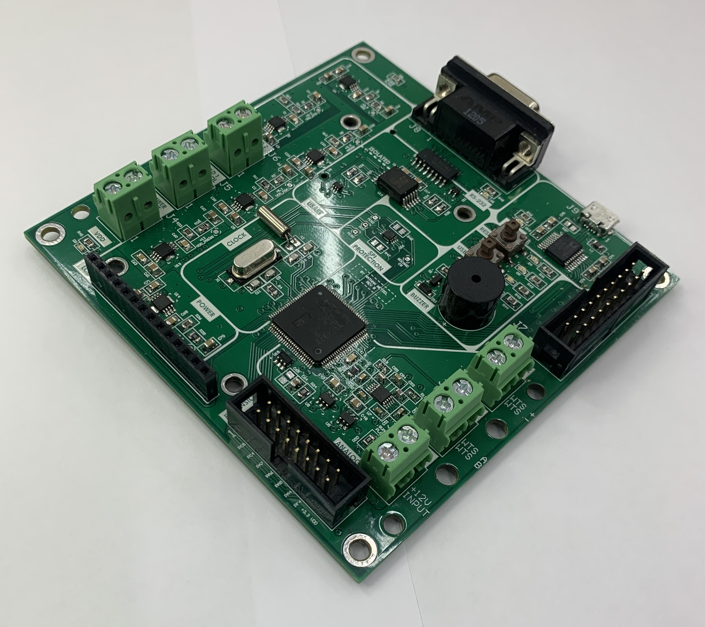 | 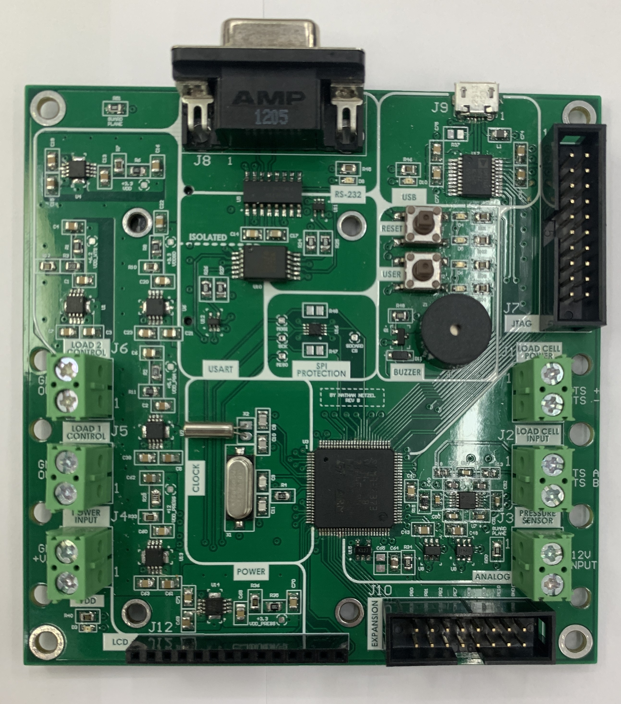 | 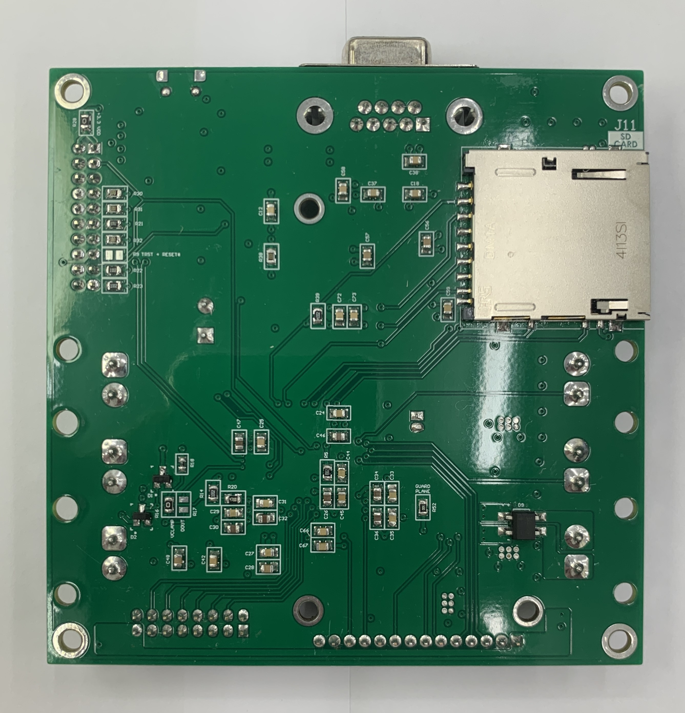 |

---

## ⚡ Igniter Activation Board

The igniter board provides safe activation of rocket motor igniters through optically isolated control channels.

### Features

* Dedicated 30 V supply
* Optical isolation
* Two ignition channels
* Relay-based activation
* Flyback protection
* Fail-safe architecture
* Status indication LEDs

| Igniter Board                                  | Top View                               | Bottom View                                  |
| ---------------------------------------------- | -------------------------------------- | -------------------------------------------- |
| 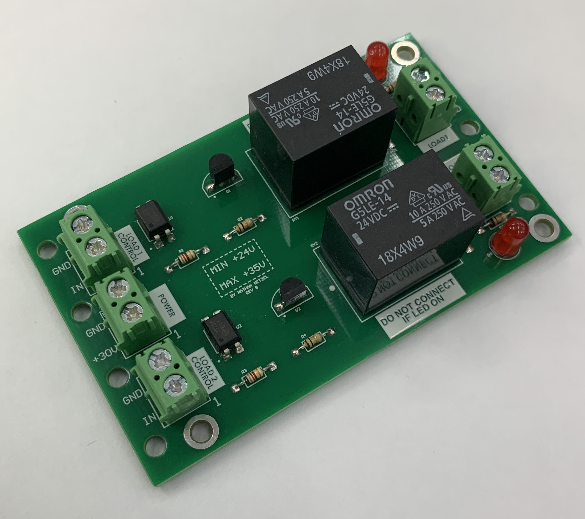 | 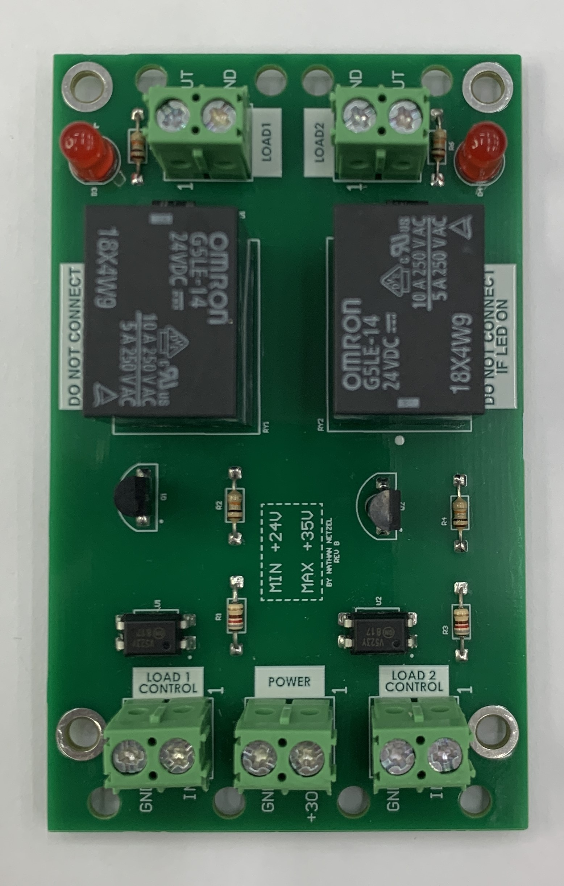 | 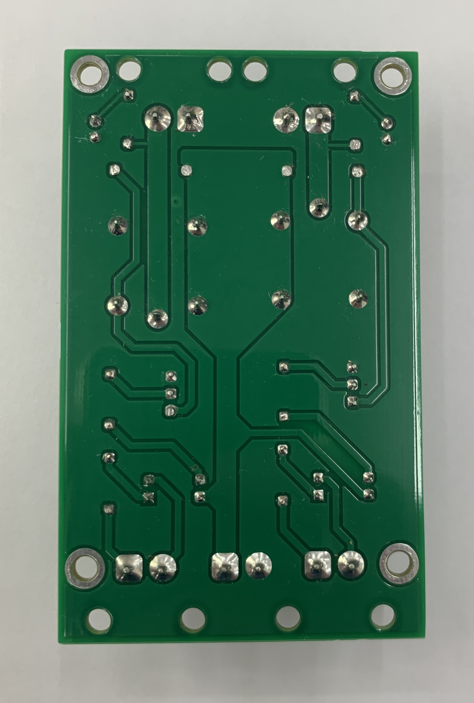 |

---

## 🔌 Power Supply Board

Dedicated power subsystem supplying both DAQ and ignition electronics.

### Features

* Transformer-based input
* Rectifier bridge
* Filtering capacitors
* Electrical separation between subsystems

| Power Board                              | Top View                         | Bottom View                            |
| ---------------------------------------- | -------------------------------- | -------------------------------------- |
| 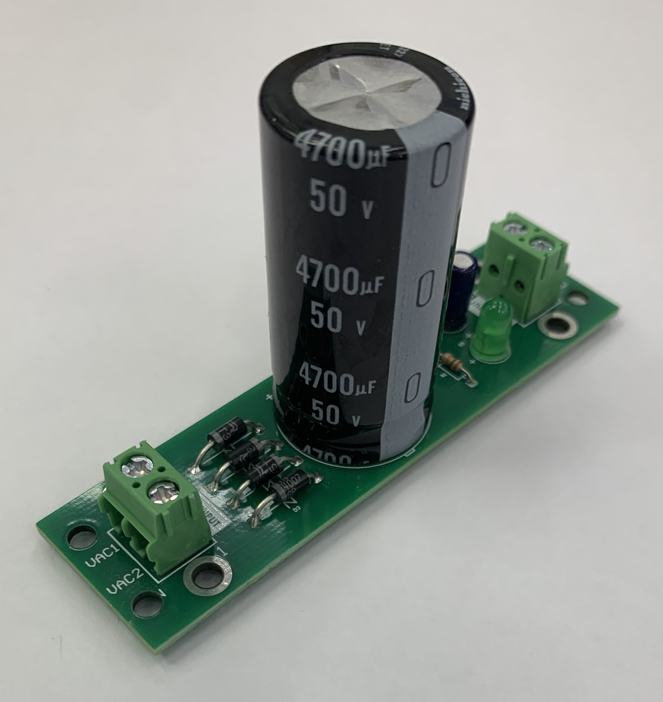 | 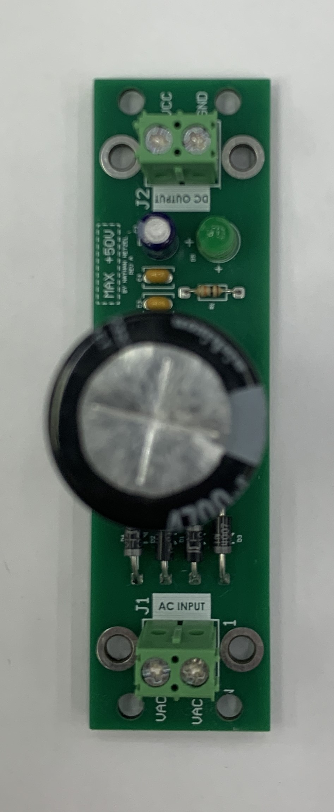 | 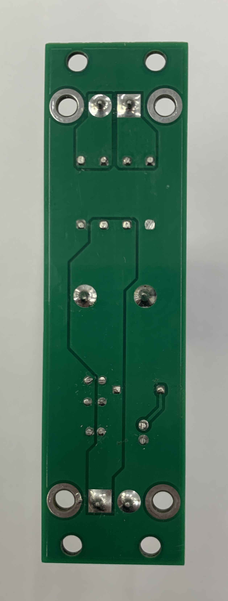 |

---

# 🧭 Original Version (2024)

## STM32F373-Based Dual-PCB Architecture

The first-generation system was implemented using two stacked boards mounted through a custom 3D-printed structure.

### Main DAQ Board

* STM32F373VCT6
* PGA308 programmable amplifier
* Sigma Delta ADC acquisition
* RS-232 communication
* Debug and power interfaces

### Pressure Board

* 4–20 mA acquisition
* TSV911 buffer
* Overvoltage protection

---

## Block Diagram

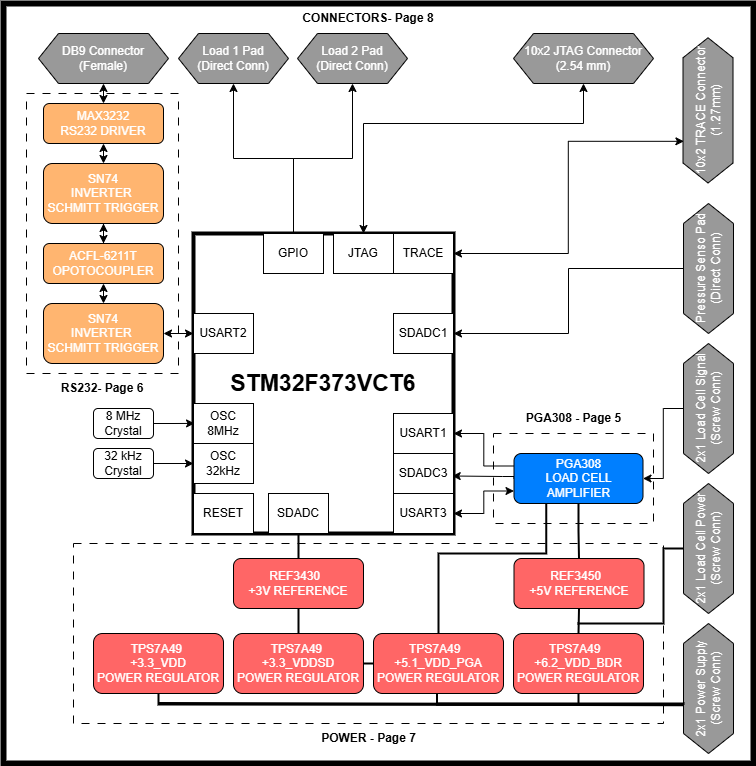

*Figure 1 – Functional architecture of the first-generation DAQ system.*

---

## Hardware Photos

| Main DAQ Board                                 | Assembled System                                     | Bottom View                                         |
| ---------------------------------------------- | ---------------------------------------------------- | --------------------------------------------------- |
| 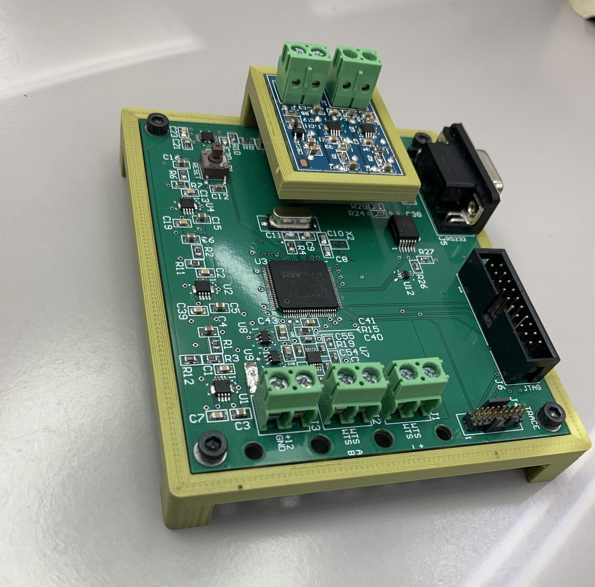 |  | 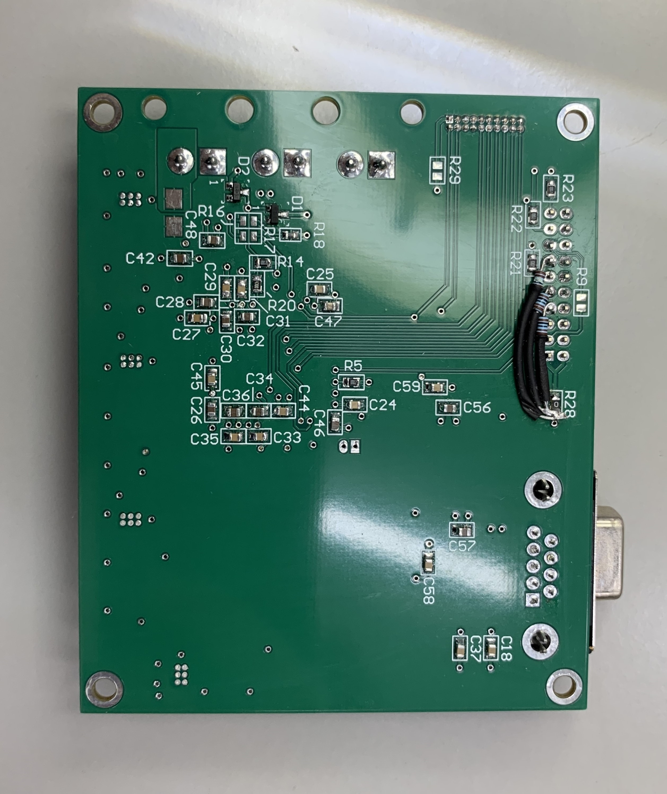 |

> The pressure acquisition board is mounted above the main DAQ board using a custom 3D-printed support structure.

---

# 📦 Embedded Drivers

Several open-source drivers developed during this project are available in separate repositories.

## Available Drivers

* [PGA308 STM32 HAL Driver](https://github.com/NathanNetzel/PGA308-STM32-HAL-Driver)  
  Driver for the Texas Instruments PGA308 programmable signal conditioner used for load cell amplification and calibration.

Additional sensor and peripheral drivers developed throughout the project will be referenced here as they become publicly available.

---

# 📖 Citation

If this repository, dataset, or associated publications contribute to your work, please cite the corresponding HardwareX publication.

---

## Author

Nathan Netzel

Electrical Engineering Student
State University of Londrina (UEL)

